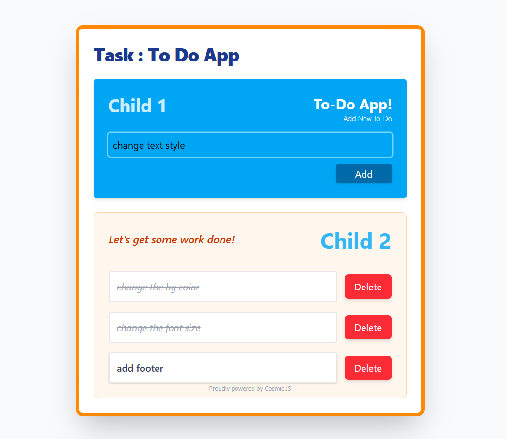

# ✅ React To-Do App

This is my first React project — a simple and clean **Task Management / To-Do App** that allows users to add, delete, and mark tasks as completed.  
Built using **React + TailwindCSS**.

---

## 🖼 Screenshots



## 🚀 Features

- ✔ Add new tasks
- ✔ Delete tasks
- ✔ Mark tasks as completed
- ✔ Clean UI using TailwindCSS
- ✔ Component-based structure (TaskInput, TaskList)
- ✔ Uses React Hooks (`useState`)
- ✔ Fully responsive

---

## 🧩 Project Structure

src/
│── App.jsx
│── components/
│ ├── TaskInput.jsx
│ └── TaskList.jsx
│── index.js
│── styles

---

## 🛠 Technologies Used

- **React**
- **JavaScript (ES6)**
- **TailwindCSS**

---

## 📦 Installation

Clone the project:

```bash
git clone <your-repo-link>
cd todo-app
```
